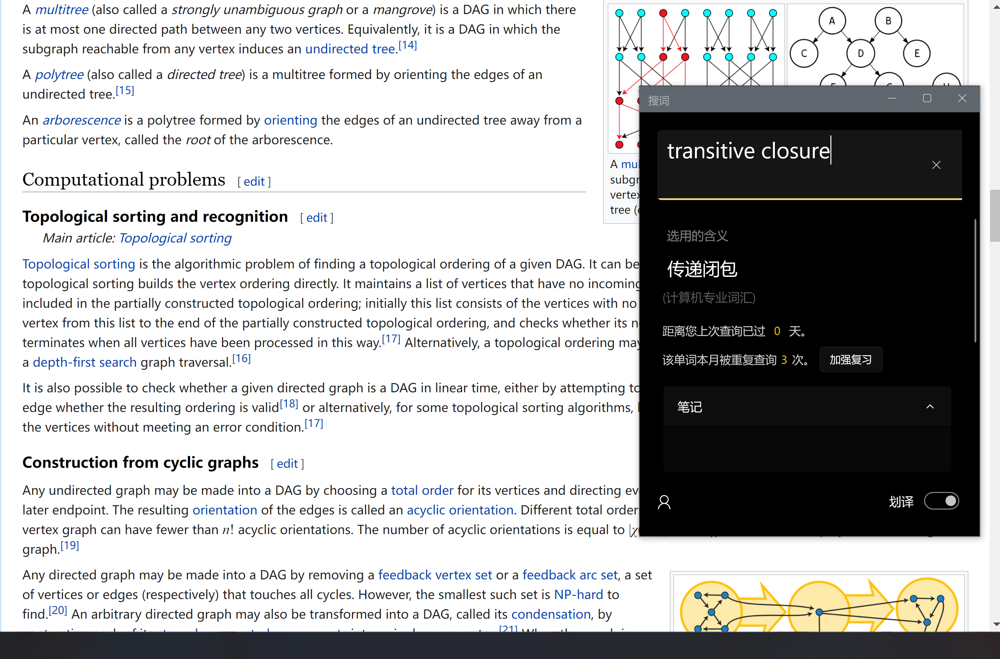
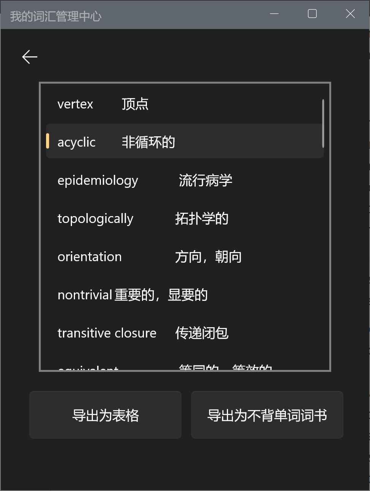
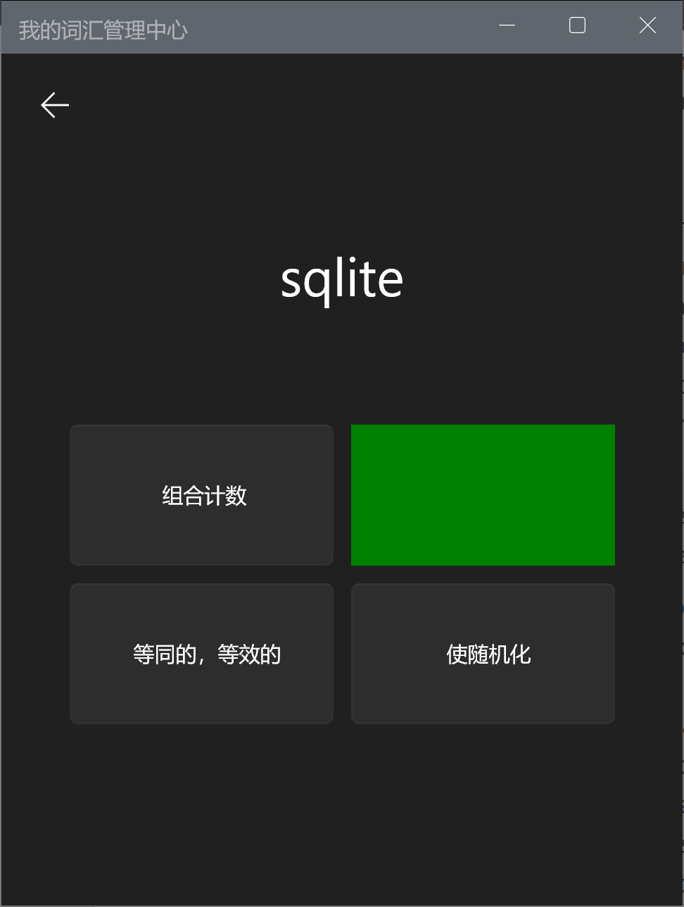
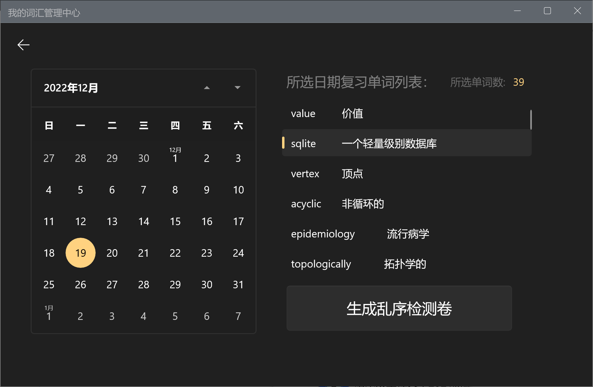
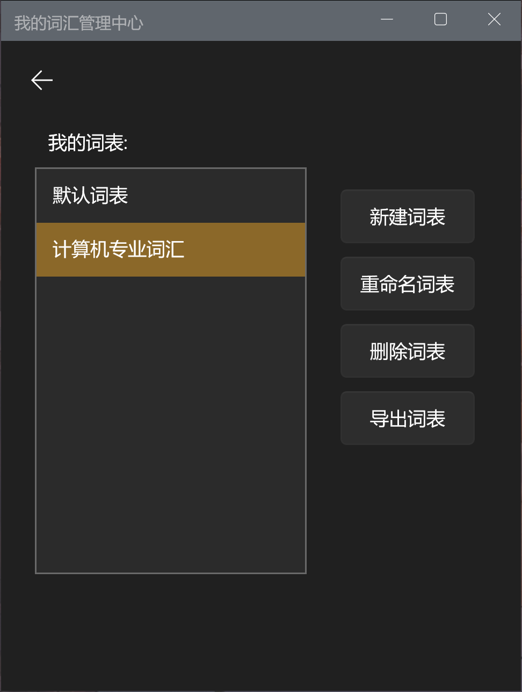

# PVEAPP
> 一款辅助程序员积累计算机专业单词的app

# Features
- 单词查询
	- 使用百度翻译和有道词典api获取词义
	- 将有可能不同的含义分离,供用户选择
	- 例句与笔记,用户可以随时记录单词语境
- 生词积累
	- 记录用户指定的特定词义
	- 统计用户的学习数据
- 词表管理
	- 新建词表,删除词表, 用户可以将一个单词添加到多个词表中
	- 导出词表, 不背单词自定义词书太麻烦? , 在这里直接一键解决!
- 策略复习
	- 根据用户的复习次数,学习时间,用户评定的单词难度,与错误次数,智能为用户生成复习顺序
	- 英文选义, 中文选词, 语境匹配, 拼写练习, 多种复习模式供用户选择
	- **在屏幕上背单词不习惯? 直接一键生成乱序默写检测卷! 配套答案同时输出, 通过指定日期生成纸质版复习材料**

> 注: 当前版本为用来水数据库课设的版本, 可能会有稳定性的问题,后续功能待完善
